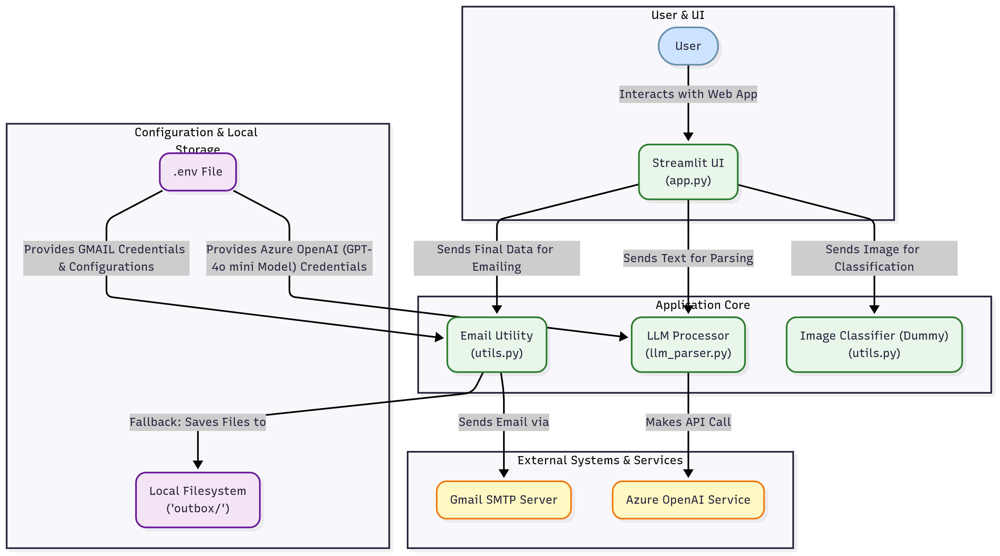

# 🚗 Car Listing Processor

**AI system that converts unstructured car listing tex## 🔄 Process Flow


## 🛡️ Security & Hardening images into standardized JSON data for automotive platforms, with automated email delivery to designated recipients.**


[](https://streamlit.io)


[](https://docs.pydantic.dev/latest/contributing/#badges)


## ⚡ What It Does

Converts unstructured car listings (text + image) → structured JSON → email delivery to designated recipients.

## 🎯 Core Features

- **🧠 AI-Powered Extraction** - GPT-4 with hardened prompts (injection-resistant)
- **🔒 Strict Validation** - Pydantic models with year ranges (1975-2025)
- **📧 Email Delivery** - Sends processed listings to designated recipients
- **🛡️ Robust Implementation** - Token limits, error handling, logging

## 🚀 Quick Start

```bash
git clone https://github.com/Youssef-Ashraf-Dev/Car_Listing.git
cd car-listing-processor
pip install -r requirements.txt
cp .env.example .env  # Add your Azure OpenAI + Gmail credentials
streamlit run app.py
```

**Tech Stack:** Python • Streamlit • LangChain • Azure OpenAI • Pydantic

## 📋 Sample Input/Output

**Input Text:**
```
Blue Ford Fusion produced in 2015 featuring a 2.0-liter engine. The vehicle has low mileage with
only 40,000 miles on the odometer. Equipped with brand-new all-season tires manufactured in 2022.
The car's windows are tinted for added privacy. Notably, the rear bumper has been replaced after
a minor collision. Priced at 1 million L.E.
```

**Output JSON:**
```json
{
    "car": {
      "body_type": "sedan",
      "color": "Blue",
      "brand": "Ford",
      "model": "Fusion",
      "manufactured_year": 2015,
      "motor_size_cc": 2000,
      "tires": {
        "type": "brand-new",
        "manufactured_year": 2022
      },
      "windows": "tinted",
      "notices": [
        {
          "type": "collision",
          "description": "The rear bumper has been replaced after a minor collision."
        }
      ],
      "price": {
        "amount": 1000000,
        "currency": "L.E"
      }
    }
}
```

## 🏗️ Architecture



**Key Files:**
- `app.py` - Streamlit UI & orchestration
- `llm_parser.py` - Hardened prompts + Pydantic models  
- `utils.py` - Email delivery + image analysis
- `.env.example` - Configuration template

## � Process Flow


## �🛡️ Security & Hardening

**Prompt Injection Protection:**
- Strict system instructions that forbid responding to user commands
- Schema-locked output (JSON only, no markdown/comments)
- Temperature 0 for deterministic results

**Data Validation:**
- Year constraints (1975-2025 for cars, 2000-2025 for tires)
- Required field validation with clear error messages
- Optional field omission (no hallucinated data)

**Error Handling:**
- Specific catches for API, parsing, and SMTP failures
- Comprehensive logging for debugging
- Development fallback: saves to local `outbox/` directory when email credentials are missing (testing convenience)

## 🧪 Testing & Validation

```bash
# Test individual components
python llm_parser.py       # LLM parsing test
python utils.py            # Email delivery test (needs test_car.jpg)

# Run full workflow via UI
streamlit run app.py
```

## 🎛️ Production Optimizations

- **Token Efficiency:** Optimized prompts reduce costs
- **Input Limits:** 800 char descriptions, 5MB images
- **Capped Responses:** 300 tokens max (sufficient for complete JSON)
